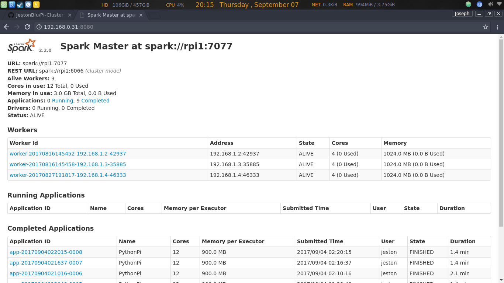

# Setting up Spark

Download and install the required software on each pi

```sh
# Install Java and Yaourt
sudo pacman -S jre8-openjdk-headless yajl

# I used to use yaourt before it went dormant and started becoming unreliable
git clone https://aur.archlinux.org/aurman.git
cd aurman
makepkg -si

# Old yaourt install
# git clone https://aur.archlinux.org/package-query.git
# cd package-query
# makepkg -si
#
# git clone https://aur.archlinux.org/yaourt.git
# cd yaourt
# makepkg -si

# Download a python distribution
wget http://repo.continuum.io/miniconda/Miniconda3-latest-Linux-armv7l.sh

# Download Spark
wget https://d3kbcqa49mib13.cloudfront.net/spark-2.2.0-bin-hadoop2.7.tgz

```

I installed both programs into ~/apps. Since rpi1 is the only pi with internet I created a simple script that would sync everything in the apps folder into the same location on all of the pis. That way if i install a package to the master node, then I can easily sync everything up without having to worry about manually installing packages on the other nodes

```sh
#! /usr/sh
rsync -razP --progress ~/apps/ rpi2:~/apps &
rsync -razP --progress ~/apps/ rpi3:~/apps &
rsync -razP --progress ~/apps/ rpi4:~/apps

```

Set up Environmental variables. Java and python both need to be in your path. It probably already is if you set them up like i described above.

```sh
# added by Miniconda3 3.16.0 installer
export SPARK_HOME=~/apps/spark-2.2
export SPARK_LOCAL_IP=localhost

export PATH="/home/jeston/apps/miniconda3/bin:$PATH"
export PATH="$SPARK_HOME/bin:$PATH"

```

Since the pis are all limited to a single GB of memory, I need to make changes to the spark conf file so there is some memory left for the OS. Change the apps/spark-2.2/conf/spark-env.sh to add

```sh
SPARK_WORKER_CORES=2
SPARK_WORKER_MEMORY=500m
```

Next add the machine names to the apps/spark-2.2/slaves

```sh
rpi2
rpi3
rpi4
```

The function for submitting spark jobs is `spark-submit`. There are numerous paramaters you can pass the function, the `spark-2.2/conf/spark-defaults.conf` file can be used to put these settings here there.  Since the RPI has a small amount of RAM, I needed to play with the default settings so that it was able to run with enough resouces. These settings were what I ended up with.

```sh
# ~/apps/spark-2.2/conf/spark-default.conf
spark.driver.memory                500m
spark.executor.memory              500m
spark.master                       spark://rpi1:7077
spark.executor.cores               2
```

There are startup scripts in apps/spark-2.2/sbin for lauching all of the nodes at once. Execute `spark-2.2/sbin/start-all.sh` to start the cluster. Then check out the logs in `spark-2.2/logs` to see the web-url print out. Here is a screenshot of the final product.



Thats it!
