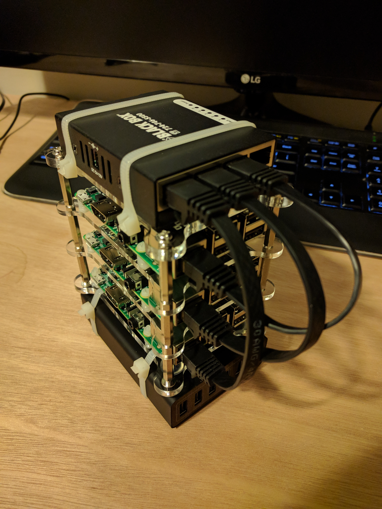
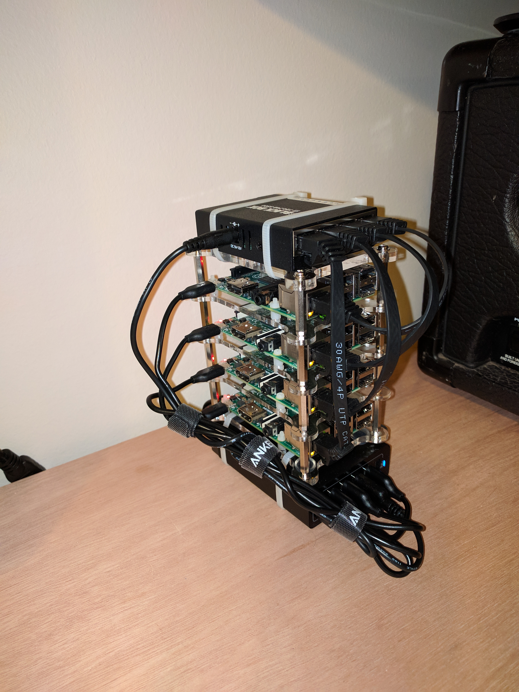

<!-- TOC depthFrom:1 depthTo:6 withLinks:1 updateOnSave:1 orderedList:0 -->

- [PySpark Raspberry Pi Cluster Project](#pyspark-raspberry-pi-cluster-project)
- [Shopping List](#shopping-list)
- [Assembly](#assembly)
- [Set up Environmental variables](#set-up-environmental-variables)

<!-- /TOC -->

# PySpark Raspberry Pi Cluster Project

This repo is being used to document my project for building a small raspberry pi cluster running spark. Similar to [this article](http://makezine.com/projects/build-a-compact-4-node-raspberry-pi-cluster/) which I used as a guide, I only wanted to have to use a single wall plug for the entire setup. I also wanted to minimize the footprint of the cluster. In this example all of the devices except for the USB hub are powered by USB.

# Shopping List
* 3 - Raspberry Pi 3b
* 1 - GeauxRobot Raspberry Pi 3 Model B 4-layer Dog Bone Stack (case)
* 1 - Anker PowerPort 6 (60W 6-Port USB Charging Hub) (power supply)
* 1 - Black Box USB-Powered 10/100 5-Port Switch
* 3 - 6" Ethernet Network Cable

# Assembly

1) Assemble the pi's and case. (I only used 3 of the 4 levels since I bought 3 pi's)


2) Attach the network switch to the top of the cluster


3) Attach the USB power supply to the bottom of the cluster


4) Attach the network cable


5) Attach the USB to mini-usb cables from the USB hub to each pi


6) Attach the USB cable to the network switch power input



# Set up Environmental variables

```sh
export JAVA_HOME=/usr/lib/jvm/java-8-openjdk
export PYTHONPATH=~/Apps/Miniconda3/envs/py35
export SPARK_HOME=~/Apps/Spark21

export PATH="$PYTHONPATH/bin:$PATH"
export PATH="$SPARK_HOME/bin:$PATH"
export PATH="$JAVA_HOME/bin:$PATH"

export SPARK_LOCAL_IP=localhost
```
